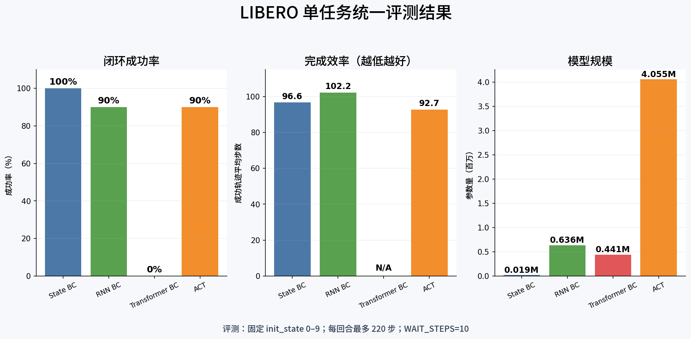

<div align="center">

# LIBERO Policy Lab

### 基于 LIBERO 的可复现机器人模仿学习实验平台

[](LICENSE)
[](https://www.python.org/)
[](https://libero-project.github.io/)

[English](README.md) · [实验结果](#实验结果) · [完整实验报告](reports/experiment_report.md) · [上游 LIBERO](https://github.com/Lifelong-Robot-Learning/LIBERO)

</div>

> [!IMPORTANT]
> 本项目是在 [LIBERO](https://github.com/Lifelong-Robot-Learning/LIBERO)
> 基础上开发的独立研究项目，并非 LIBERO 官方发行版。LIBERO 原作者仍拥有原始基准、
> 环境、数据集和资源的相应署名；本项目新增了策略基线、统一评测器、实验产物和结果分析。

## 项目定位

离线验证误差很低，并不代表策略进入机器人环境后就能完成任务。本项目把训练、闭环
rollout、录像与结果导出组织在一起，用统一协议比较以下方法：

- State BC：仅使用机器人状态的轻量 MLP 基线；
- Vision BC：使用双相机图像和机器人状态；
- RNN BC：利用 LSTM 聚合近期历史；
- Transformer BC：使用因果注意力建模时序上下文；
- ACT：通过 CVAE 和 action chunk 预测短期动作序列；
- Multi-task ACT：加入任务条件的多任务 ACT 实验版本。

项目还提供固定初始状态、统一最大步数、视频导出和 JSON 汇总的闭环评测脚本，以及
包含失败案例与局限性分析的完整实验报告。

## 实验结果

当前结果来自 LIBERO-Spatial 任务 **“拿起小模具上的黑碗并将其放到盘子上”**。
所有方法使用同一组 10 个初始状态、10 步环境稳定过程和 220 步最大控制长度。



| 方法 | 参数量 | 成功率 | 成功轨迹平均步数 | 结论 |
|:--|--:|--:|--:|:--|
| State BC | 19,463 | **10/10（100%）** | 96.6 | 当前窄分布任务上的最强小模型基线 |
| Vision BC | 406,023 | 未评测 | — | 当前仓库缺少 checkpoint |
| RNN BC | 636,295 | **9/10（90%）** | 102.2 | 历史信息有效，但仍有闭环漂移 |
| Transformer BC | 441,351 | **0/10（0%）** | — | 离线误差未能转化为闭环成功率 |
| ACT | 4,054,983 | **9/10（90%）** | **92.7** | 成功轨迹完成速度最快 |

以上是 10 个 episode 的工程对比，不是完整的统计排行榜。逐初始状态结果、不确定性、
评测协议与局限性见[完整实验报告](reports/experiment_report.md)，机器可读结果见
[`reports/evaluation/results.json`](reports/evaluation/results.json)。

## 安装

当前环境沿用上游 LIBERO 配置，推荐 Python 3.8：

```bash
git clone https://github.com/Steelwoolballs/LIBERO.git
cd LIBERO

conda create -n libero-policy-lab python=3.8.13 -y
conda activate libero-policy-lab

pip install -r requirements.txt
pip install torch==1.11.0+cu113 torchvision==0.12.0+cu113 \
  torchaudio==0.11.0 --extra-index-url https://download.pytorch.org/whl/cu113
pip install -e .
```

若本机 CUDA 版本不同，请安装匹配的 PyTorch 构建。MuJoCo 和无头渲染配置可参考
[LIBERO 官方文档](https://lifelong-robot-learning.github.io/LIBERO/)。

## 下载数据

```bash
python benchmark_scripts/download_libero_datasets.py \
  --datasets libero_spatial \
  --use-huggingface
```

数据默认位于 `libero/datasets/`，且不会提交到 Git。LIBERO 数据集采用 CC BY 4.0
许可，重新分发前请核对上游条款。

## 复现统一评测

仓库当前包含 State BC、RNN BC、Transformer BC 和 ACT 的 checkpoint。在仓库根目录运行：

```bash
python my_bc/evaluate_single_task.py \
  --episodes 10 \
  --max-steps 220 \
  --record-resolution 512 \
  --save-videos \
  --output-dir reports/evaluation
```

评测器会生成 JSON 汇总；启用 `--save-videos` 后，还会保存每个 episode 的视频。
若某种方法缺少 checkpoint，评测器会记录原因并跳过，因此当前 Vision BC 显示为未评测。

多任务 ACT 的训练入口为：

```bash
python my_bc/muti_ACT/train_ACT_bc.py \
  --dataset-dir libero/datasets/libero_spatial \
  --checkpoint multi_act_policy.pt
```

`muti_ACT` 是现有代码使用的历史目录名，后续会在保持兼容的前提下迁移为 `multi_ACT`。

## 仓库结构

```text
.
├── libero/                    # 上游基准、环境与资源
├── benchmark_scripts/         # 上游数据集和任务工具
├── my_bc/
│   ├── BC/                    # State BC
│   ├── VISION/                # 双相机 Vision BC
│   ├── RNN/                   # RNN BC
│   ├── TF/                    # Transformer BC
│   ├── ACT/                   # 单任务 ACT
│   ├── muti_ACT/              # 多任务 ACT（实验中）
│   └── evaluate_single_task.py
└── reports/                   # 结果、图片、报告与汇报材料
```

## 当前状态与路线图

本项目目前属于研究原型。单任务对比已经具有完整产物，多任务评测仍在进行中：

- [ ] 补齐并发布 Vision BC checkpoint；
- [ ] 加入多随机种子实验和置信区间；
- [ ] 完成 task-conditioned Multi-task ACT 基准；
- [ ] 将脚本内常量统一迁移到命令行配置；
- [ ] 增加 smoke test 和轻量 CI；
- [ ] 将大模型权重迁移到版本化 Release 或模型托管平台。

## 贡献、署名与许可

欢迎提交复现记录、问题修复、新基线和评测改进。提交前请阅读
[CONTRIBUTING.md](CONTRIBUTING.md)。报告模型结果时，请同时提供任务、随机种子、
checkpoint 和完整评测命令。

使用本仓库时请引用原始 LIBERO 论文；如果使用了本项目新增的实现或实验产物，请同时
链接本仓库及对应 commit。代码采用 [MIT License](LICENSE)，并保留上游版权声明；
数据集和部分资源遵循各自的上游许可。
